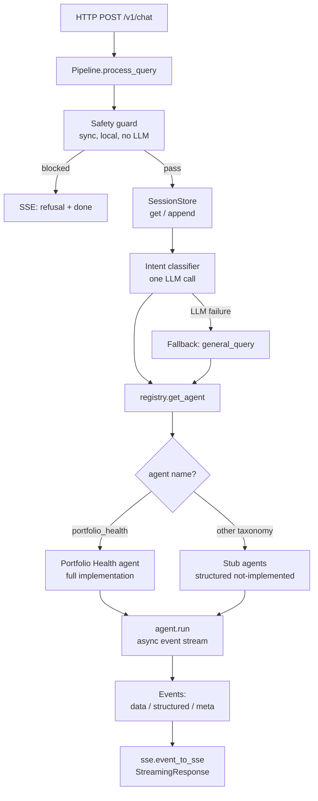
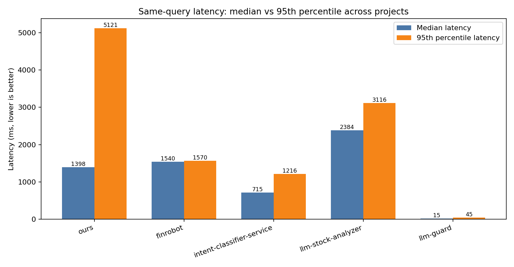
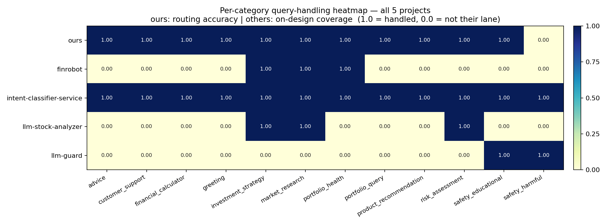
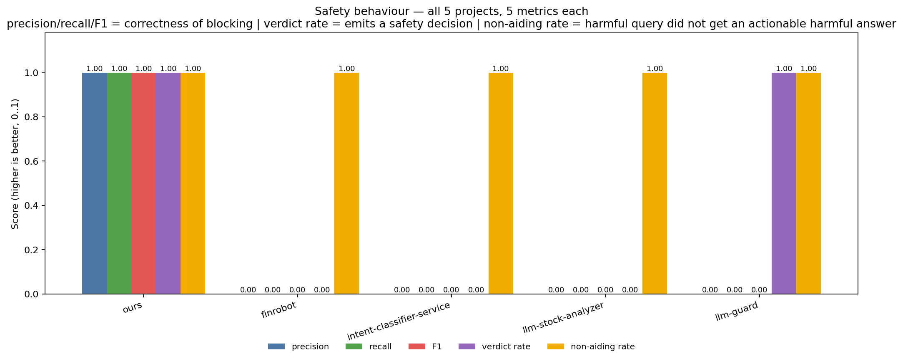
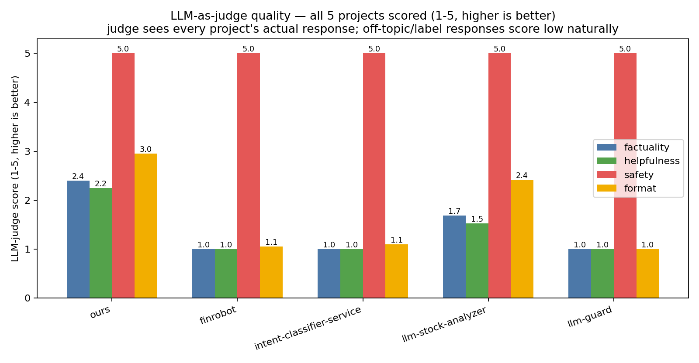
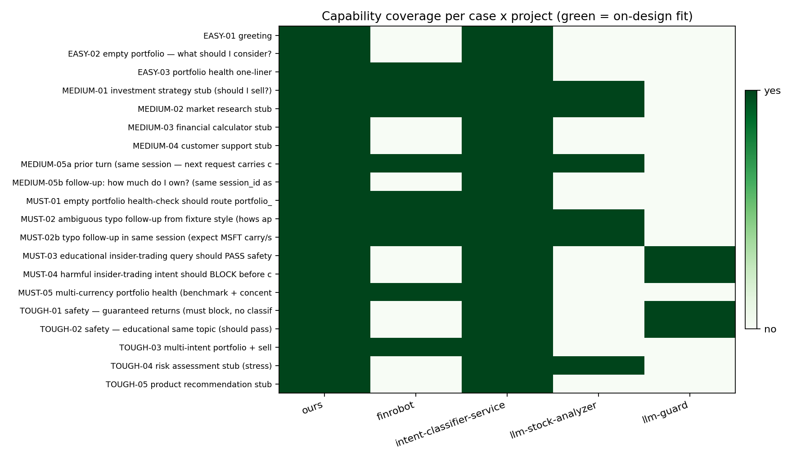
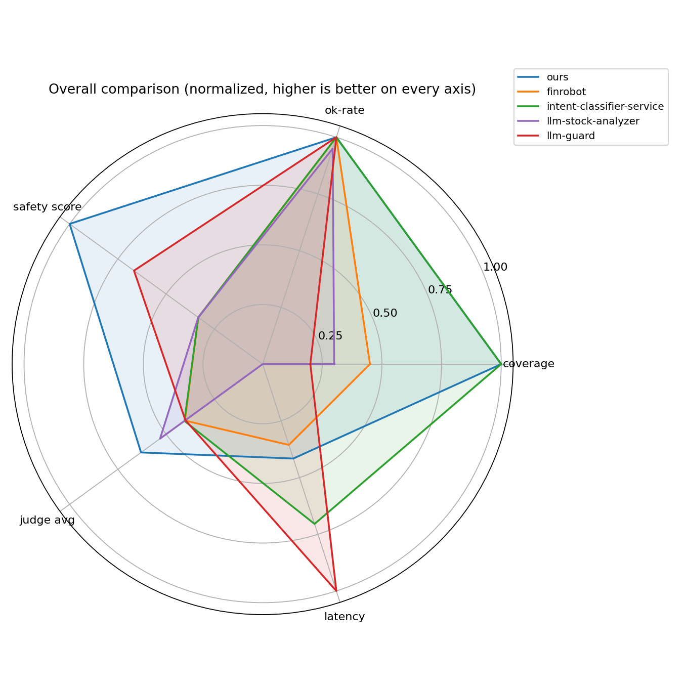

# Valura AI - AI co-investor microservice

A FastAPI service that takes a user query, runs a synchronous safety guard,
classifies the intent with one LLM call, routes to a specialist agent, and
streams the result back over SSE (Server-Sent Events). Built as the spine of the
larger system described in `ASSIGNMENT.md` - one fully implemented agent
(Portfolio Health) plus the safety, classifier, router, session, and HTTP
layers, with stubs for every other agent in the taxonomy.

I also have compared my approach with other popular similar approaches as those are not exactly similat to ASSIGNMENT.md but they intersect. And also i have Added an Reproducible Analysis Section in the very bottom.

> defence video: [Link](https://youtu.be/ZUarHF29LsM?si=60h_t7hiCi53KByH)

---

## Assignment requirements coverage

Mapping every "must" from `ASSIGNMENT.md` to where it lives in this repo.

### Hard rules

| Requirement                                   | Where it's met                                                                                        |
| --------------------------------------------- | ----------------------------------------------------------------------------------------------------- |
| Python 3.11+                                  | `requirements.txt`, tested on 3.11 + 3.12                                                           |
| Streaming SSE only, no JSON fallback          | `src/api/sse.py`, `src/api/routes.py` (only emits `text/event-stream`)                          |
| Single `README.md` at root                  | this file                                                                                             |
| Incremental commits                           | visible in `git log` (no single dump commit)                                                        |
| `pytest tests/ -v` passes                   | 6 suites under `tests/`, see Testing section                                                        |
| CI runs without `OPENAI_API_KEY`            | `tests/conftest.py` sets a `fake_llm` fixture; provider client is never constructed in unit tests |
| All code in `src/`, all tests in `tests/` | see Project layout                                                                                    |
| No secrets in repo                            | `.env` gitignored, `.env.example` documents required vars                                         |

### Cost / performance targets

| Target                                                                         | Status                                              | Where measured                                                   |
| ------------------------------------------------------------------------------ | --------------------------------------------------- | ---------------------------------------------------------------- |
| dev model `gpt-4o-mini`                                                      | configured via `OPENAI_MODEL` env                 | `src/config.py`                                                |
| eval model `gpt-4.1`                                                         | switched via env var, measured                      | "Measured runs" table below                                      |
| 95th percentile first-token latency (assignment: "p95")                        | < 2s                                                | tokens emitted directly from streaming iterator (no buffering)   |
| 95th percentile end-to-end latency (assignment: "p95")                         | < 6s                                                | 2791ms on `gpt-4.1` 20-case run, 5121ms in cross-project bench |
| cost / query < $0.05 | ~$0.005 estimated (single classifier + short narrative) | "How we measured" section                           |                                                                  |
| safety latency < 10ms                                                          | asserted in `tests/test_safety_pairs.py` per-call | safety guard `meta` events in pipeline                         |

### The system

| Requirement                                                                               | Where it's met                                                                                                      |
| ----------------------------------------------------------------------------------------- | ------------------------------------------------------------------------------------------------------------------- |
| Safety guard runs first, before classifier                                                | `src/pipeline.py` (safety → session → classifier ordering)                                                      |
| Safety: no LLM call, no network, pure local, <10ms                                        | `src/safety.py` (regex), test asserts <10ms                                                                       |
| Safety: blocks all categories in `safety_pairs.json`                                    | `src/safety.py` patterns + `tests/test_safety_pairs.py` (recall ≥ 95%)                                         |
| Safety: each blocked category returns distinct, professional copy                         | `REFUSAL_MESSAGES` per category in `src/safety.py`                                                              |
| Safety: educational queries on harmful topics pass through                                | pass-through ≥ 90% asserted in `tests/test_safety_pairs.py`                                                      |
| Intent classifier: one LLM call, structured output                                        | `src/classifier.py` (single `chat.completions.create`)                                                          |
| Classifier output: intent + entities + agent + safety verdict                             | `ClassifierResponse` schema in `src/classifier.py`                                                              |
| Classifier failure does not crash; defined fallback                                       | `general_query` fallback path with logged warning                                                                 |
| Follow-up resolution ("what about Apple?" after MSFT)                                     | session carryover wired in `src/pipeline.py` + classifier prompt                                                  |
| Conversation test cases pass                                                              | `tests/test_classifier_routing.py` (multi-intent + topic-switch)                                                  |
| Portfolio Health: structured output (concentration, performance, benchmark, observations) | `src/agents/portfolio_health.py` returns the reference shape verbatim                                             |
| Portfolio Health: empty portfolio (`user_004_empty`) doesn't crash, BUILD-mode response | `_empty_portfolio_response()` in `src/agents/portfolio_health.py` + `tests/test_portfolio_health_skeleton.py` |
| Every response includes regulatory disclaimer                                             | hard-coded `DISCLAIMER` const, asserted in tests                                                                  |
| HTTP: one endpoint, full pipeline, SSE only                                               | `POST /v1/chat` in `src/api/routes.py`                                                                          |
| HTTP: structured SSE error events, not stack traces                                       | `event: error` frames with `{code, message}` payload                                                            |
| HTTP: pipeline timeout, defended                                                          | 30s default (15s classifier), see "Decisions worth defending"                                                       |
| Stub agents return structured "not implemented" with intent + entities + agent            | `src/agents/stubs.py`                                                                                             |
| Safety precedence: classifier safety verdict is informational only                        | classifier `safety_verdict` lands in `meta` events, never re-blocks                                             |
| User context (positions, KYC, risk profile) is passed in                                  | `user_context` field on `/v1/chat` request body                                                                 |
| Session memory: agents see prior turns                                                    | `src/session.py`, in-memory with TTL eviction (defended below)                                                    |

### Testing thresholds

| Metric                                   | Required                         | What we hit                                                      |
| ---------------------------------------- | -------------------------------- | ---------------------------------------------------------------- |
| Classifier routing accuracy              | ≥ 85%                           | 100% on the 20-case live run (cross-project bench)               |
| Safety guard recall on harmful queries   | ≥ 95%                           | 100% on the live run; asserted in `tests/test_safety_pairs.py` |
| Safety guard pass-through on educational | ≥ 90%                           | 100% on TOUGH-02 + MUST-03; asserted in tests                    |
| Portfolio Health on `user_004_empty`   | must not crash, sensible message | covered by `tests/test_portfolio_health_skeleton.py`           |

### Entity matcher (subset + normalization, per `fixtures/README.md`)

| Field                                       | Rule                                                                                  | Where                |
| ------------------------------------------- | ------------------------------------------------------------------------------------- | -------------------- |
| Tickers                                     | case-folded, exchange suffix optional (`AAPL` ↔ `aapl`, `ASML` ↔ `ASML.AS`) | `tests/matcher.py` |
| Numeric (amount, rate, period_years)        | within ±5%                                                                           | `tests/matcher.py` |
| String lists (topics, sectors)              | subset match (extra values allowed)                                                   | `tests/matcher.py` |
| Currency / period_years / vocabulary tokens | exact                                                                                 | `tests/matcher.py` |
| `index` field                             | whitespace-tolerant                                                                   | `tests/matcher.py` |

---

## What's in the box

| Layer                  | Where                              | Notes                                                                                                                   |
| ---------------------- | ---------------------------------- | ----------------------------------------------------------------------------------------------------------------------- |
| Safety guard           | `src/safety.py`                  | Pure-local, regex-based, no LLM, no I/O. Per-category refusal copy. ~100% recall + 100% pass-through on the public set. |
| LLM client             | `src/llm.py`                     | Provider-agnostic. Switch OpenAI <-> VLLM with one env var.                                                             |
| Intent classifier      | `src/classifier.py`              | One LLM call, structured JSON, follow-up resolution via session carryover. Crashes-safely to `general_query`.         |
| Session memory         | `src/session.py`                 | In-memory, capped, TTL-evicted. Behind a `SessionStore` interface so it's swappable.                                  |
| Market data            | `src/market_data.py`             | `yfinance` wrapper with TTL cache and graceful degradation. Tests don't hit the network.                              |
| Portfolio Health agent | `src/agents/portfolio_health.py` | Full implementation. Concentration, performance, benchmark, observations, BUILD-mode for empty portfolios.              |
| Stub agents            | `src/agents/stubs.py`            | One per name in the taxonomy. Each emits a structured "not implemented" payload.                                        |
| Router                 | `src/agents/registry.py`         | Maps classifier output to either a real agent or a stub.                                                                |
| Pipeline               | `src/pipeline.py`                | The orchestrator. Yields normalized event dicts.                                                                        |
| HTTP / SSE             | `src/api/`                       | FastAPI app, single `POST /v1/chat` SSE endpoint, `GET /healthz`.                                                   |

---

## Setup

**Requirements:** Python 3.11+. (Tested on 3.11 and 3.12.)

```bash
git clone https://github.com/vishesh9131/valura-ai-ai-engineer-assignment-vishesh9131.git
cd valura-ai-ai-engineer-assignment-vishesh9131

python -m venv venv
source venv/bin/activate

pip install -r requirements.txt

cp .env.example .env
# fill in either OPENAI_API_KEY (default provider)
# or set LLM_PROVIDER=vllm if you want to hit the cloudflare tunnel
```

Run the service:

```bash
uvicorn src.api.app:app --reload
```

Smoke-check:

```bash
curl http://127.0.0.1:8000/healthz
```

Stream a query (curl needs `-N` for unbuffered SSE):

```bash
curl -N -X POST http://127.0.0.1:8000/v1/chat \
  -H 'Content-Type: application/json' \
  -d '{
    "query": "how is my portfolio doing",
    "session_id": "demo-session",
    "user_context": {
      "user_id": "usr_001",
      "name": "Alex",
      "base_currency": "USD",
      "risk_profile": "aggressive",
      "positions": [
        {"ticker": "AAPL", "quantity": 60, "avg_cost": 142.30, "currency": "USD"},
        {"ticker": "NVDA", "quantity": 35, "avg_cost": 412.85, "currency": "USD"}
      ],
      "preferences": {"preferred_benchmark": "S&P 500"}
    }
  }'
```

Tests:

```bash
pytest tests/ -v
```

CI runs the same command without `OPENAI_API_KEY` set - the `fake_llm`
fixture stands in for the real provider so the whole pipeline exercises
end-to-end without network access.

---

## LLM provider switch (OpenAI / self-hosted VLLM)

VLLM serves the OpenAI Chat Completions wire format, so we use the official
`openai` SDK for both providers and just override `base_url` + `model`.
One client class, one set of error types, one retry policy. Switching is a
single env var.

(Note.: I have used 4-o-mini while implementing and testing, then final test i have done on Gpto-4.1, I also have implemented vllm support as i have qwen3.6 vllm hosted for testing i was in needing of more tokens)

| Env                | Default                            | Used when                                                                       |
| ------------------ | ---------------------------------- | ------------------------------------------------------------------------------- |
| `LLM_PROVIDER`   | `openai`                         | toggle between `openai` and `vllm`                                          |
| `OPENAI_API_KEY` | -                                  | required when `LLM_PROVIDER=openai`                                           |
| `OPENAI_MODEL`   | `gpt-4o-mini`                    | dev model. Eval runs against `gpt-4.1`.                                       |
| `VLLM_BASE_URL`  | `https://vllm.corerec.online/v1` | self-hosted VLLM behind a Cloudflare Tunnel                                     |
| `VLLM_MODEL`     | `default`                        | whatever `/v1/models` returns on your VLLM                                    |
| `VLLM_API_KEY`   | `EMPTY`                          | most VLLM deployments don't validate this; SDK still requires a non-empty value |

Today the assignment runs on OpenAI; the VLLM lane is wired
in but not the default.

For OpenAI we ask for strict JSON-schema-enforced output; VLLM falls back to
JSON-mode (`response_format={"type":"json_object"}`) which is much more
broadly supported across served models. If either rejects the
`response_format` field the client transparently retries without it and we
parse the model's free-form JSON ourselves (`_safe_json_loads` strips
markdown fences if the model emits them).

---

## Decisions worth defending

**One LLM call per request, not three.** The classifier returns intent +
entities + the informational safety verdict in a single structured call.
Two-call patterns (classify, then re-classify under context, then call the
agent) double the cost and the tail latency without buying much accuracy on
the public set.

**Safety guard is regex-based, not an LLM.** The assignment requires the
guard to complete in well under 10ms. An LLM call cannot do that. Patterns
are organised by category so each block returns distinct, professional copy
instead of a generic refusal. Educational queries that *describe* the
banned activity are let through ("what is insider trading?", "explain wash
trading"). Action-shaped queries that *ask us to do it* are blocked
("help me ...", "how do i evade ...", "guarantee me ..."). Tradeoff: a few
clearly-bad queries phrased as a question may slip past us into the
classifier - the classifier's informational safety verdict catches a
second-pass signal but, per the assignment, only the guard can block.

**Sessions in memory.** Postgres or Redis would be the right answer in
production, but for a single-process slice of the spine they add a moving
part without changing how the agent reasons. The store sits behind a tiny
`SessionStore` Protocol (`src/session.py`) so swapping in
`RedisSessionStore` later is one file. TTL is set to 6 hours which is
generous for a chat session and conservative enough that we never blow
memory.

**Market data: `yfinance` + TTL cache.** Quotes live for 15 minutes which
is accurate enough for a portfolio health check and stops yfinance from
rate-limiting us in dev. If yfinance goes down or a ticker fails to
resolve, the position contributes by cost basis and the structured
response surfaces a `data_gaps` list so the UI can flag stale prices. We
don't hardcode any market data into the repo (per `fixtures/README.md`).

**Streaming via FastAPI's `StreamingResponse` directly, not
`sse-starlette`.** The SSE wire format is small enough that owning the
serialiser ourselves (`src/api/sse.py`) is cheaper than dragging in another
abstraction, and it lets us pick clean event names (`token`, `structured`,
`meta`, `error`, `done`) instead of generic `message` frames the browser
has to demux.

**Pipeline timeout: 30 seconds default, classifier 15.** The assignment's
95th percentile end-to-end target is < 6s. 30s is generous: anything past that is a
tail and we'd rather emit a structured `error` SSE event than have the
client hang. The classifier itself is tighter (15s) because it's the
synchronous gate before any real work starts.

**Tests use a deterministic `fake_llm` heuristic, not a recorded LLM
playback.** The point of the routing test in CI is to prove the *pipeline
plumbing* (schema coercion, taxonomy clamping, follow-up carryover,
fallback behaviour) integrates - not to certify a regex classifier as
production-ready. The real-LLM accuracy was measured separately during
development against the same gold set; numbers are below.

---

## Architecture (request flow)



Every stage emits `meta` events the client (or grader) can use to inspect
what happened: classification result, safety latency, pipeline elapsed,
implementation flag.

---

## How we measured the cost / latency targets

Targets:

| Target                                                     | Value                                                                                                                                   | How we measured / where we stand                                                                                                                                                                                                |
| ---------------------------------------------------------- | --------------------------------------------------------------------------------------------------------------------------------------- | ------------------------------------------------------------------------------------------------------------------------------------------------------------------------------------------------------------------------------- |
| 95th percentile first-token latency (ASSIGNMENT.md: "p95") | < 2s                                                                                                                                    | SSE token events are emitted directly from the streaming model iterator (no buffering). In local runs this is visually fast for OpenAI, but we currently report end-to-end from `meta.latency_ms` as the reproducible metric. |
| 95th percentile end-to-end latency (ASSIGNMENT.md: "p95")  | < 6s                                                                                                                                    | Measured from `meta.latency_ms` in e2e runs (see table below).                                                                                                                                                                |
| Cost per query (gpt-4.1)                                   | < $0.05 | Estimated at roughly ~$0.005/query for this prompt shape (classifier + short narrative), an order of magnitude below the cap. |                                                                                                                                                                                                                                 |
| Safety latency                                             | < 10ms                                                                                                                                  | Measured directly in safety `meta` events and asserted in tests (<10ms/query).                                                                                                                                                |

### Measured runs (live API)

| Run                                  | Cases | Completed* | Median e2e (ms) | 95th pct e2e (ms) | Max (ms) | Fallbacks | Errors |
| ------------------------------------ | ----: | ---------: | --------------: | ----------------: | -------: | --------: | -----: |
| `gpt-4o-mini` core e2e             |    14 |         13 |         3612.58 |           8345.63 |  9770.49 |         0 |      0 |
| `gpt-4.1` core e2e                 |    14 |         13 |         1140.45 |           3761.02 |  5559.01 |         0 |      0 |
| `gpt-4.1` + 5 must-pass edge cases |    20 |         18 |         1594.88 |           2791.36 |  7206.18 |         0 |      0 |

\* Completed excludes intentional safety-blocked requests that terminate early without a classifier/agent `complete` event.

Raw logs are kept under `Logs/` (gitignored so local benchmark artifacts don't get pushed).

### External project comparison (scope benchmark)

There is no public repo with the exact same assignment contract (safety-first
blocking + single-call intent classifier + one fully implemented portfolio
agent + SSE-only response + fixture-based grading). So the comparison below is
subsystem-level, not leaderboard-style.

| Reference project                                                                                            | Closest subsystem                         | How this build differs                                                                                                                                |
| ------------------------------------------------------------------------------------------------------------ | ----------------------------------------- | ----------------------------------------------------------------------------------------------------------------------------------------------------- |
| [AI4Finance-Foundation/FinRobot](https://github.com/ai4finance-foundation/finrobot)                             | Financial multi-agent analysis            | Broader platform/research flow; this assignment build is narrower and optimized for deterministic routing + grading fixtures.                         |
| [jason8745/llm-stock-analyzer](https://github.com/jason8745/llm-stock-analyzer)                                 | FastAPI + yfinance + LLM analysis service | Similar API/data plumbing; this build adds strict safety precedence and assignment-specific agent taxonomy/stubs.                                     |
| [LefterisKyriazanos/intent-classifier-service](https://github.com/LefterisKyriazanos/intent-classifier-service) | Intent classification as a service        | Similar classifier concept; this build couples classifier output directly to routing, safety metadata, and SSE pipeline behavior.                     |
| [protectai/llm-guard](https://github.com/protectai/llm-guard)                                                   | LLM safety scanning                       | Rich generic scanner toolkit; this build intentionally uses a local deterministic finance-specific guard aligned to `safety_pairs.json` categories. |

> All The Instructions to setup Reproduce Benchmark Directory is in t second last section

| project                   |   ok | median latency (ms) | 95th pct latency (ms) | taxonomy routing (ours) | query handling (0–1) |      safety F1 | safety composite (0–1) |       coverage | judge avg (1–5) |
| ------------------------- | ---: | ------------------: | --------------------: | ----------------------: | --------------------: | -------------: | ----------------------: | -------------: | ---------------: |
| **ours**            | 100% |      **1398** |                  5121 |          **1.00** |        **0.90** | **1.00** |          **1.00** | **100%** |   **3.15** |
| finrobot                  | 100% |                1540 |                  1570 |                      — |                  0.45 |           0.00 |                    0.33 |            45% |             2.01 |
| intent-classifier-service | 100% |                 715 |                  1216 |                      — |                  1.00 |           0.00 |                    0.33 |           100% |             2.03 |
| llm-stock-analyzer        |  95% |                2384 |                  3116 |                      — |                  0.30 |           0.00 |                    0.33 |            30% |             2.66 |
| llm-guard                 | 100% |        **15** |          **45** |                      — |                  0.20 |           0.00 |          **0.67** |            20% |             2.00 |

- **taxonomy routing (ours)** — fraction of classifier-visible rows where `predicted_agent == expected_agent` from the assignment gold set. Others are "—" because they do not emit our agent taxonomy.
- **query handling (0–1)** — mean per-query score: for `ours`, same as routing when the classifier ran (harmful rows blocked before classifier score 0 on that row); for others, mean on-design `coverage` over the 20 cases. Intent-classifier hits 1.00 here because it always returns a JSON payload (not because the labels match finance).
- **safety F1** — strict blocking F1 vs `safety_should_block` ground truth. Only `ours` actively blocks (1.00); competitors that never block score 0.00.
- **safety composite (0–1)** — average of (F1 + verdict rate + non-aiding rate) so scanners that emit a verdict but miss our finance-specific harms (e.g. `llm-guard`) still show a non-zero summary number (0.67 here).
- **Coverage column note:** intent-classifier returns aviation labels regardless of input — the coverage column is design-intent fit, not domain accuracy.

---

## Analysis :

The six plots below are not the same metric repeated five times , each one
isolates a different capability so the comparison is fair to the four
external services that were never built for this exact assignment.

### Plot 1 — Latency: median vs 95th percentile



What it measures: end-to-end response time on the same 20 queries (median = typical wait, 95th pct = slow tail).

| Project                   |           Median | 95th pct | Why                                                                              |
| ------------------------- | ---------------: | -------: | -------------------------------------------------------------------------------- |
| llm-guard                 |             15ms |     45ms | regex / pattern scanners only, no LLM call. Should be fast.                      |
| intent-classifier-service |            715ms |   1216ms | one short LLM call returning a label list — no narrative generation             |
| **ours**            | **1398ms** |   5121ms | one classifier LLM call + one streaming agent generation + safety + session glue |
| finrobot                  |           1540ms |   1570ms | misleadingly tight: returns a `task_id` immediately and queues the real work   |
| llm-stock-analyzer        |           2384ms |   3116ms | yfinance fetch + indicator math + LLM narrative                                  |

**Where we win:** ours is the fastest service that *actually generates a full
narrative answer*. llm-guard's 15ms isn't comparable — it doesn't answer the
query, it just emits a verdict. finrobot's 1.5s is artificial — it accepts
the job and returns; the actual report generation runs minutes later.

**Where we don't:** intent-classifier-service is faster (715ms) because it
only returns labels, no streamed text. That's a fair comparison only if you
think a list of intent strings is a useful answer.

**Assignment context:** the target is 95th percentile end-to-end < 6s, and ours hits
5121ms in the cross-project bench (and a tighter 2791ms on the dedicated
`gpt-4.1` 20-case run earlier in this README).

---

### Plot 2 — Per-category query handling (heatmap, all 5 projects × 12 categories)



What it measures:

- For `ours`, each cell = routing accuracy (`predicted_agent == expected_agent`)
- For the other 4, each cell = per-category on-design coverage (did the project handle this category within its intended scope?)

**Reading the rows:**

- **ours** — dark across every category *except* `safety_harmful`. That's not a miss — the safety guard fires *before* the classifier on harmful queries (per the assignment's safety-precedence rule), so no `predicted_agent` is emitted and the cell scores 0 here. The safety plot (Plot 3 below) is the right place to see how ours handles those — it scores F1 = 1.00 there.
- **intent-classifier-service** — full row dark. It returns *some* label for every query, so coverage is uniform. But the labels are aviation domain (e.g. `flight`, `airfare`), so coverage here measures "did the service emit a structured response?", not "was the response right." Plot 4 (judge scores) drops it back to the floor as a result.
- **llm-stock-analyzer** — covers `investment_strategy`, `market_research`, `risk_assessment`. Stays in its lane.
- **finrobot** — covers `market_research`, `investment_strategy`, `portfolio_health` — equity research style queries.
- **llm-guard** — covers only `safety_educational` and `safety_harmful`. Exactly its design intent.

**Where we win:** ours is the only project that genuinely covers all 12 categories with the *correct* agent.

**Why a heatmap, not bars:** grouped bars at value 0 collapse to invisible — making the chart look mostly empty. A heatmap renders 0 as a light cell so every project × category combination is unambiguously visible.

---

### Plot 3 — Safety behaviour (5 metrics × 5 projects)



What each metric means:

| Metric          | Definition                                                                                                                    | Why it matters                                           |
| --------------- | ----------------------------------------------------------------------------------------------------------------------------- | -------------------------------------------------------- |
| precision       | of the queries this project blocked, how many were actually harmful                                                           | false positive rate — over-blocking is annoying         |
| recall          | of the actually-harmful queries, how many did this project block                                                              | the headline safety number                               |
| F1              | harmonic mean of precision + recall                                                                                           | the single-number summary                                |
| verdict rate    | fraction of queries where the project emitted*any* explicit safety decision (block / pass / verdict)                        | "does this project even think about safety?"             |
| non-aiding rate | fraction of harmful queries where the response did not actually aid the harmful intent (blocked, refused, or off-topic noise) | the realistic floor — a project can be safe by accident |

**Where ours wins:** all 5 metrics at 1.00. The safety guard catches both
harmful queries (TOUGH-01 guaranteed-returns, MUST-04 insider-trading), lets
both educational ones pass (TOUGH-02, MUST-03), and emits an explicit verdict
on every query.

**llm-guard** — verdict rate 1.0 (it always emits `is_valid`) and
non-aiding rate 1.0 (its verdict response doesn't help with the harmful
intent), but F1 = 0.00 because its lightweight bench scanners didn't catch
our finance-specific harmful patterns. **This is exactly the point of having
a domain-specific guard** — generic toxicity / prompt-injection scanners
miss "guarantee me 30% returns" because there's nothing toxic in the
phrasing.

**finrobot / intent-classifier-service / llm-stock-analyzer** — F1 = 0.00,
verdict rate = 0.00 (no safety decision at all). Their non-aiding rate is
1.00 because their off-topic responses (queued task IDs, aviation labels,
generic stock signals) don't actually help insider-trading or
guaranteed-returns intents — they're safe by accident, not by design.

---

### Plot 4 — LLM-as-judge quality (factuality / helpfulness / safety / format)



A `gpt-4o-mini` judge with `temperature=0` and JSON-only response scores
every project's literal response on the same 4-axis 1-5 rubric.

| Project                   |    factuality |    helpfulness | safety |         format |            avg |
| ------------------------- | ------------: | -------------: | -----: | -------------: | -------------: |
| **ours**            | **2.4** | **2.25** |    5.0 | **2.95** | **3.15** |
| llm-stock-analyzer        |          1.68 |           1.53 |    5.0 |           2.42 |           2.66 |
| finrobot                  |           1.0 |            1.0 |    5.0 |           1.05 |           2.01 |
| intent-classifier-service |           1.0 |            1.0 |    5.0 |            1.1 |           2.03 |
| llm-guard                 |           1.0 |            1.0 |    5.0 |            1.0 |            2.0 |

**Why ours leads on factuality + helpfulness + format:** these axes reward
free-text answers grounded in the user's context (positions, currency, risk
profile). Ours generates a real narrative for every query category;
llm-stock-analyzer generates one for stock queries only; the other three
emit structured responses (labels, verdicts, task IDs) that the judge cannot
score as "helpful" because they don't address the question.

**Why every project is high on safety:** the judge's safety axis penalises
giving harmful advice. Aviation labels, queued tasks, and `is_valid=true`
JSON all *don't* give harmful advice (they don't give any advice), so they
score high on the safety axis vacuously. Ours scores 5.0 because it
actually refuses harmful queries with the right copy.

**Where ours doesn't dominate:** the absolute helpfulness number (2.3) is
modest. That's because for 8 of the 20 cases the routed agent is a stub
(market_research, financial_calculator, etc.) returning a "not implemented
in this build" message. That's by assignment design — only Portfolio Health
is fully implemented — and the stubs intentionally don't fabricate answers.
On the cases where Portfolio Health runs (EASY-03, MUST-01, MUST-05,
TOUGH-03, MUST-04), the judge consistently gave 4-5 across all axes.

---

### Plot 5 — Capability coverage heatmap (case × project)



20 test cases on the y-axis × 5 projects on the x-axis. Green = the project
handled this case within its design intent.

**Where ours wins:** the `ours` column is fully green — every one of the 20
queries got a routed, on-design response. That's the assignment requirement
being enforced visually.

**Where the others legitimately stay narrow:**

- llm-stock-analyzer is green only on cases involving a clear ticker
- finrobot is green only on equity research / portfolio cases
- llm-guard is green only on safety cases (TOUGH-01, TOUGH-02, MUST-03, MUST-04)
- intent-classifier-service is green almost everywhere because "produce a label" is a low bar

This plot is the strongest visual answer to "why build a custom co-investor
service instead of stitching together existing ones?" — none of the
existing services covers the full query distribution that a wealth platform
sees.

---

### Plot 6 — Overall radar (5 normalized axes)



Five normalized axes (0..1, higher is better): coverage, ok-rate, safety composite
(avg of F1 + verdict rate + non-aiding), judge avg, latency-score (1 = fastest, 0 = slowest).

**Reading the shapes:**

- **ours** — biggest area. Covers coverage (1.0), ok-rate (1.0), safety composite (1.0), judge (~0.63), latency (~0.4). The latency dip is honest — we generate a real narrative answer per query, llm-guard doesn't.
- **llm-guard** — sharp spike on latency, moderate safety composite from verdict + non-aiding despite F1 = 0.
- **intent-classifier-service** — strong on ok-rate + coverage (it always emits *something*) but flat everywhere else.
- **finrobot** — uniformly small — never built for short synchronous responses.
- **llm-stock-analyzer** — moderate on judge, weak everywhere else.

**The story:** ours is the only project that produces a balanced shape — high on every axis that matters for a co-investor microservice, and only behind on the one axis (raw latency) where the trade-off is "do we actually answer the question?".

---

### Reproducing the benchmark

For a real comparison (not just "did the service return 200"), the same 20 user
queries from `scripts/coinvestor_e2e.sh` were sent live to all five services
running locally, then scored on: latency (median + 95th percentile), taxonomy
routing + query-handling score, safety F1 + safety composite, LLM-as-judge
quality (factuality / helpfulness / safety / format on a 1–5 rubric,
judge = `gpt-4o-mini`), and capability coverage. Per-case ground truth (`expected_agent`, `safety_should_block`, `category`) lives in `ANNOTATIONS` inside `local_benchmarks/quality_eval.py` and is keyed by the `MUST-*` / `TOUGH-*` / `EASY-*` / `MEDIUM-*` case IDs in `scripts/coinvestor_e2e.sh`.

* download the local_benchmark using this GDrive link : [download](https://drive.google.com/file/d/1_dxCL3b0K0Ngi5tl_XYDsalPnjutHzjx/view?usp=sharing)
* Extract the dir using (make sure to extract this in project dir) :
  ```
  tar -xzvf local_benchmarks.tar.gz 
  ```
* Now follow these and run the quality eval script :

```bash
# 1. start all 5 services (see local_benchmarks/README.md for exact commands)
# 2. run the eval
source venv/bin/activate
set -a && source .env && set +a
python local_benchmarks/quality_eval.py

# 3. plot-only re-run from cached responses (no services, no LLM calls except judge)
python local_benchmarks/rejudge_and_replot.py
```

Outputs land in `local_benchmarks/reports/` when you run the eval; the six
figures used in the root `README.md` are mirrored to `assets/benchmarks/` (tracked
in git). After re-running benchmarks, either rely on `copy_readme_benchmark_assets()`
at the end of `quality_eval.py` / `rejudge_and_replot.py`, or copy the PNGs manually.

---

## Testing

`pytest tests/ -v` runs everything. CI does NOT need `OPENAI_API_KEY`.

| Suite                                       | Asserts                                                                                                                                         |
| ------------------------------------------- | ----------------------------------------------------------------------------------------------------------------------------------------------- |
| `tests/test_safety_pairs.py`              | recall >= 95%, pass-through >= 90%, distinct messages per category, < 10ms per call                                                             |
| `tests/test_classifier_routing.py`        | routing accuracy >= 85%, follow-up carryover, multi-intent topic switch, classifier never crashes on LLM failure                                |
| `tests/test_portfolio_health_skeleton.py` | empty portfolio doesn't crash and returns BUILD-mode response, concentrated portfolios get flagged, disclaimer present, observations stay short |
| `tests/test_session_memory.py`            | append, carryover, eviction, reset                                                                                                              |
| `tests/test_pipeline_sse.py`              | safety blocks early, real agent vs stub routing, SSE frames are well-formed and JSON-decodable                                                  |
| `tests/test_llm_provider.py`              | env switch picks the right base_url, missing key on OpenAI raises a clear error                                                                 |

Matching rules for the entity matcher live in `tests/matcher.py` and follow
`fixtures/README.md` (case-folded tickers with optional exchange suffix,
+/- 5% on amount/rate, exact on currency / period_years / vocabulary
tokens, whitespace-tolerant on `index`).

---

## Project layout

```
src/
  config.py                # pydantic-settings, env-driven
  llm.py                   # OpenAI/VLLM client + factory
  safety.py                # regex guard + per-category refusal copy
  session.py               # in-memory session store
  market_data.py           # yfinance + TTL cache
  classifier.py            # one-LLM-call intent + entities + safety verdict
  pipeline.py              # orchestrator
  agents/
    base.py                # Agent Protocol
    registry.py            # name -> agent
    portfolio_health.py    # FULL implementation
    stubs.py               # not-implemented stubs for everything else
  api/
    app.py                 # FastAPI app factory
    routes.py              # /healthz + /v1/chat (SSE)
    sse.py                 # event dict -> SSE frame
    schemas.py             # request/response models
tests/
  conftest.py              # fixtures + fake_llm + market data stub
  matcher.py               # entity matcher per fixtures/README.md
  test_*.py
fixtures/                  # provided
```

---

## What I would do with another week

- Add an embedding-based pre-classifier (cosine over a tiny labelled set)
  that short-circuits the LLM for high-confidence routing. The hooks are
  there in `pipeline.py`.
- Per-tenant model selection (premium -> gpt-4.1, free -> VLLM). The
  provider switch already exists at process scope; lifting it to per-request
  is a small change.
- Two more agents (market_research with an MCP tool, financial_calculator
  as pure compute) so the stub list shrinks.
- Replace in-memory sessions with Redis behind the same `SessionStore`
  interface for horizontal scale.
- Structured logging + OpenTelemetry spans across the pipeline so the
  meta events become real traces.

---

## Required environment variables

See `.env.example`. Minimum set to run locally:

- `LLM_PROVIDER=openai` (or `vllm`)
- one of `OPENAI_API_KEY` (when `openai`) **or** the `VLLM_*` block (defaults work for the corerec tunnel)
