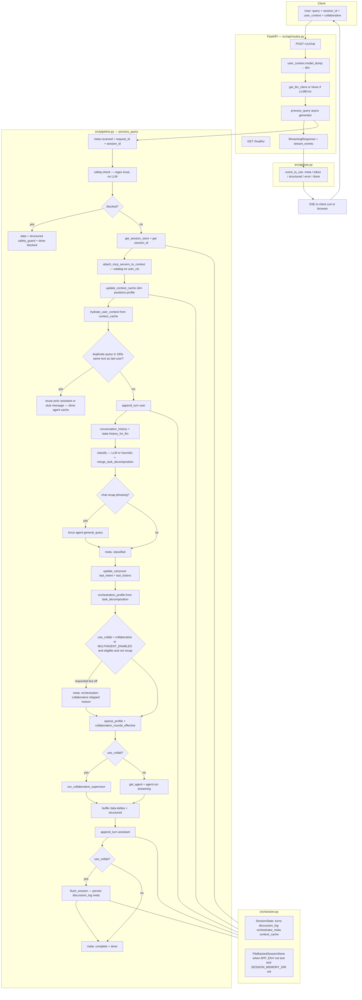
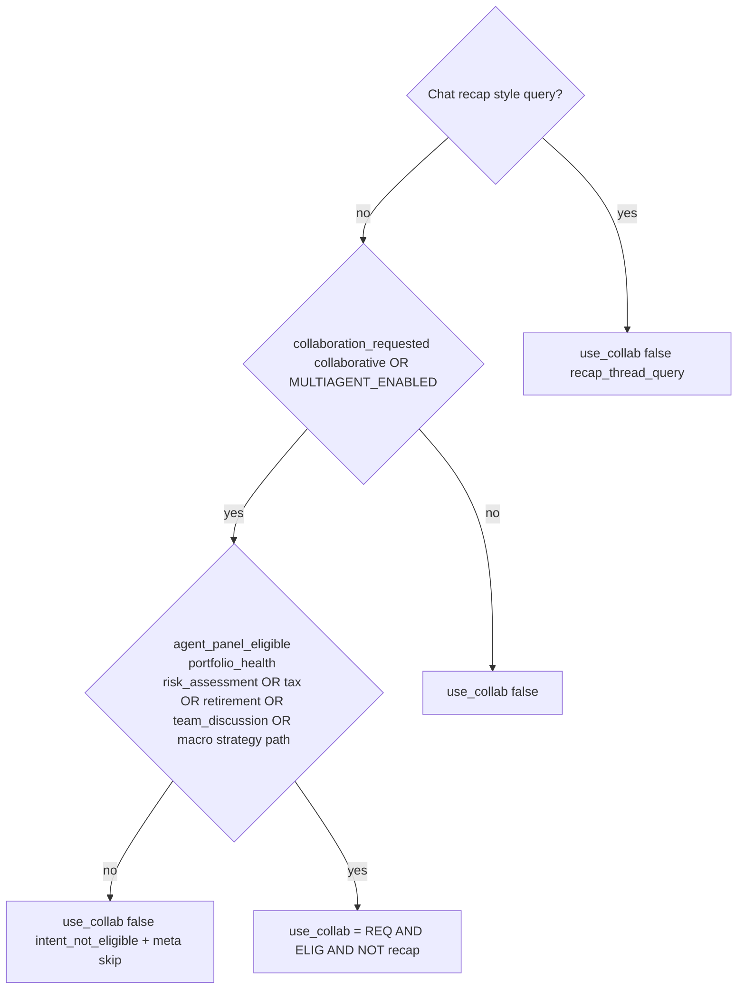
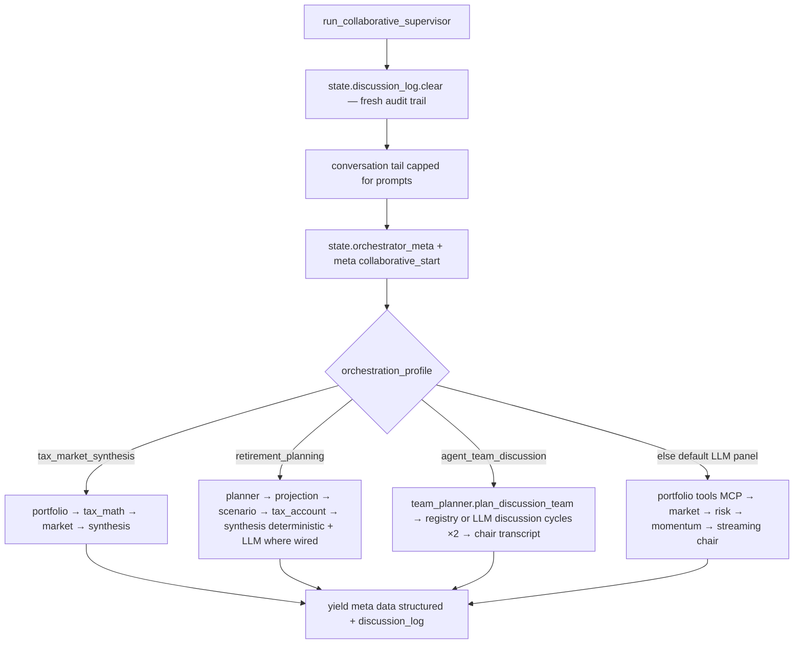

# Assignment 2 — flow from user query to SSE response

Two views: **end-to-end** (what the repo actually runs) and **supervisor** (what happens inside multi-agent mode).

---

## 1. End-to-end: `POST /v1/chat` → SSE

---

## 2. Collaboration gate (how `use_collab` is decided)

---

## 3. Inside `run_collaborative_supervisor` (profiles)

Tooling note: portfolio and market bootstrap rounds call the **MCP shim** (`invoke_mcp`) and log `_mcp_calls` inside `discussion_log` entries where implemented.

---

## 4. Event types on the wire (after `sse.event_to_sse`)

| Pipeline `type` | SSE `event` name | Role |
|----------------|------------------|------|
| `meta` | `meta` | Progress, routing, orchestration hints |
| `data` | `token` | Narrative delta (`delta`) |
| `structured` | `structured` | JSON payload (agent, blocked, tool summaries, etc.) |
| `error` | `error` | Terminal failure message |
| `done` | `done` | End of request; includes `blocked`, `agent`, etc. |

---

## Key files

| Layer | Path |
|-------|------|
| HTTP + SSE | `src/api/routes.py`, `src/api/sse.py`, `src/api/schemas.py` |
| Orchestration | `src/pipeline.py` |
| Safety | `src/safety.py` |
| Session | `src/session.py` |
| MCP catalog | `src/mcp_integration.py`, `src/mcp_servers/registry.py` |
| Classifier + decomposition | `src/classifier.py`, `src/intent_decompose.py` |
| Multi-agent | `src/orchestration/supervisor.py`, `collaborative_llm_agents.py`, `team_planner.py`, `team_registry_bridge.py` |
| Agents | `src/agents/*`, `src/agents/registry.py` |
